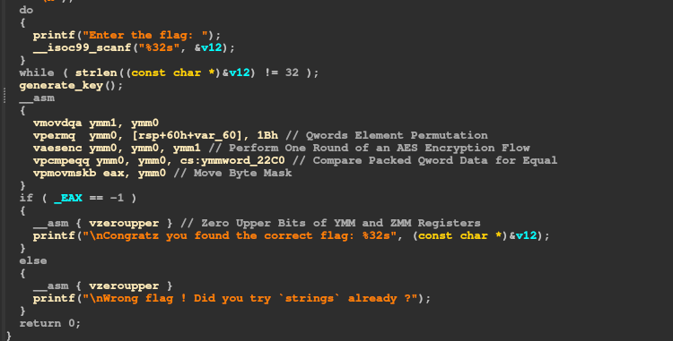

# IDA Pro Inline Assembly Helper

Ever found yourself scratching your head over the mysterious `__asm { VSCATTERPF0DPD }` instruction in your decompiled code? Don't worry, this is the **IDA Pro Inline Assembly Helper** – your go-to solution for deciphering inline assembly intricacies.

This compact IDAPython plugin is designed to elevate your reverse engineering experience by enhancing the HexRays decompiler's output with insightful comments for inline assembly. Currently, it exclusively supports the x86 architecture.



> Gain a deeper understanding of x86 instructions with the help of this plugin. For comprehensive instruction details, refer to [Felix Cloutier's x86 Opcode and Instruction Reference](https://www.felixcloutier.com/x86/).

## Usage 

Getting started is a breeze! Just follow these simple steps:

1. Download the Python files provided.
2. Install the required packages by running the following commands in your terminal or command prompt:
   ```bash
   pip install beautifulsoup4 requests
   ```
   For ArchLinux user : 
   ```bash
   sudo pacman -Syu python-beautifulsoup4
   ```
3. Place the files in the `plugins` folder of your IDA installation.

Now, you're all set to unveil the secrets behind those perplexing assembly instructions!

## Known Issues

While striving for perfection, there might be some unnoticed errors in the code. Your feedback is invaluable in improving the plugin, so don't hesitate to report any issues you encounter.

- The plugin has been tested on Arch Linux with IDA Pro 8.2; Windows support is theoretical.
- 
## Automatic Updates

Stay current with the ever-evolving world of assembly instructions! This plugin is designed to automatically check for updates every two weeks. Enjoy continuous improvement without lifting a finger!

## Future Enhancements

The journey doesn't end here! Exciting plans for future releases include:

- Synthesizing assembler block logic for a more coherent understanding.
- Extending the functionality to the disassembly output. Imagine hovering over an instruction and opening a small QT widget with precise information – that's on the radar!

Feel free to contribute ideas or report any feature requests to make this plugin even more robust and user-friendly.

Happy reverse engineering! 🕵️‍♂️💻
